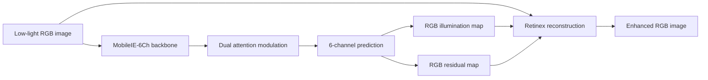

<div align="center">

# MobileIE-6Ch

### Efficient Low-Light Image Enhancement for NTIRE 2026

**HIT-LLIE-team solution for the NTIRE 2026 Efficient Low-Light Image Enhancement Challenge**

<p>
  <a href="https://arxiv.org/html/2605.02212v1">
    
  </a>
  
  
  
  <a href="./LICENSE">
    
  </a>
</p>

<p>
  <a href="https://arxiv.org/html/2605.02212v1"><b>Challenge Report</b></a>
  |
  <a href="#quick-start"><b>Quick Start</b></a>
  |
  <a href="#results"><b>Results</b></a>
  |
  <a href="#citation"><b>Citation</b></a>
</p>

</div>

---

## Overview

**MobileIE-6Ch** is an ultra-lightweight low-light image enhancement network designed for efficient deployment. The model is based on the MobileIE family and introduces a **6-channel Retinex-style prediction head** that estimates:

- **3 RGB illumination channels** for color-aware brightness recovery
- **3 residual channels** for noise/detail compensation

The released checkpoint contains only **101,922 parameters**, while still targeting visually pleasing enhancement under strict NTIRE efficiency constraints. The repository includes inference code, DDP training code, configuration files, and the submitted checkpoint.

## Why MobileIE-6Ch?

| Design Goal | What We Do |
| --- | --- |
| Compact inference | Use the slim reparameterized MobileIE form for deployment |
| Color-aware illumination | Predict RGB illumination instead of a single grayscale map |
| Noise/detail recovery | Add an RGB residual branch after Retinex division |
| Training capacity | Use Multi-Branch Reparameterization during training |
| Stable optimization | Combine warm-up, EMA, gradient clipping, cosine scheduling, and multi-scale crops |

## Results

MobileIE-6Ch is listed in the official **NTIRE 2026 Efficient Low-Light Image Enhancement Challenge** report.

| Evaluation Table | SSIM | LPIPS | DISTS | LIQE | MUSIQ | Q-Align | Params | Final Rank |
| --- | ---: | ---: | ---: | ---: | ---: | ---: | ---: | ---: |
| Main technical-report table | 0.5766 | 0.5176 | 0.2319 | 2.2977 | 60.3387 | 3.2007 | 101,922 | **7** |
| Full final-testing table | 0.5766 | 0.5176 | 0.2319 | 2.2977 | 60.3387 | 3.2007 | 101,922 | **9** |

The full final-testing table includes teams that participated in final testing but did not submit a technical report. The main table reports teams included in the technical-methods section of the challenge report.

## Method

MobileIE-6Ch follows a compact Retinex-inspired enhancement pipeline. Instead of estimating only one illumination channel, the model predicts RGB illumination maps and residual corrections jointly.



The final image is reconstructed as:

```text
enhanced = input / illumination + residual
```

During training, multi-branch convolution blocks improve representation capacity. For inference, the model uses the slim reparameterized form, keeping the checkpoint small and easy to deploy.

## Quick Start

### 1. Installation

```bash
conda create -n mobileie python=3.10 -y
conda activate mobileie
pip install -r requirements.txt
```

If your CUDA version requires a specific PyTorch wheel, install the matching PyTorch build first, then install the remaining dependencies.

### 2. Prepare Images

Put low-light images into:

```text
competition/low/
```

### 3. Run Inference

```bash
python infer_6channel.py
```

Enhanced images will be saved to:

```text
competition/enhanced_pt/
```

By default, the script loads the released checkpoint:

```text
result/model_best.pt
```

The script uses CUDA automatically when available and falls back to CPU otherwise.

## Training

Prepare paired training data with matching filenames:

```text
lowlight/
|-- low/       # Low-light inputs
`-- normal/    # Normal-light ground truth
```

Launch DDP training:

```bash
bash train_ddp.sh
```

Choose a custom GPU list if needed:

```bash
bash train_ddp.sh "0" 1
bash train_ddp.sh "0,1" 2
bash train_ddp.sh "0,1,2,3" 4
```

The main configuration is in `config/lle.yaml`.

| Setting | Value |
| --- | --- |
| Model | MobileIE-6Ch |
| Channels | 32 |
| Epochs | 800 |
| Batch size | 16 |
| Warm-up | 20 epochs |
| Learning rate | 1.5e-4 |
| Scheduler | Cosine annealing |
| Patch size | 768 |
| Cross validation | 5 folds |
| EMA | Enabled |
| Gradient clipping | 0.5 |

Training logs and checkpoints are written under `experiments/`.

## Repository Layout

```text
.
|-- competition/
|   |-- low/                 # Inference inputs
|   `-- enhanced_pt/         # Inference outputs
|-- config/
|   `-- lle.yaml             # Training and model configuration
|-- data/
|   |-- lledata.py           # Low-light enhancement dataset loader
|   `-- ispdata.py
|-- lowlight/
|   |-- low/                 # Training low-light images
|   `-- normal/              # Training ground-truth images
|-- model/
|   |-- lle.py               # Original MobileIE LLE model
|   |-- lle_6channel.py      # MobileIE-6Ch model
|   `-- utils_IWO.py         # MBR and feature modulation blocks
|-- result/
|   `-- model_best.pt        # Released MobileIE-6Ch checkpoint
|-- infer_6channel.py        # Inference entry point
|-- main_ddp.py              # DDP training entry point
|-- train_ddp.sh             # Training launcher
|-- requirements.txt
`-- team_info.txt
```

## Team

**HIT-LLIE-team**

| Member | Affiliation |
| --- | --- |
| Xinbai Wang | Harbin Institute of Technology |
| Duo Liu | Harbin Institute of Technology |

Contact information is available in `team_info.txt`.

## Citation

If this repository is helpful to your research, please cite the NTIRE 2026 challenge report and this solution.

```bibtex
@article{yan2026ntire,
  title={NTIRE 2026 Challenge on Efficient Low Light Image Enhancement: Methods and Results},
  author={Yan, Jiebin and Tu, Chenyu and Lin, Qinghua and others},
  journal={arXiv preprint arXiv:2605.02212},
  year={2026}
}
```

```bibtex
@misc{hitllie2026mobileie6ch,
  title={MobileIE-6Ch: Efficient Low-Light Image Enhancement for NTIRE 2026},
  author={Wang, Xinbai and Liu, Duo},
  year={2026},
  note={HIT-LLIE-team submission to the NTIRE 2026 Efficient Low-Light Image Enhancement Challenge}
}
```

## Acknowledgements

This project was developed for the **NTIRE 2026 Efficient Low-Light Image Enhancement Challenge**. We thank the challenge organizers and the MobileIE authors for the baseline inspiration.

## License

This repository is released under the **Apache License 2.0**. See [LICENSE](./LICENSE) for details.
