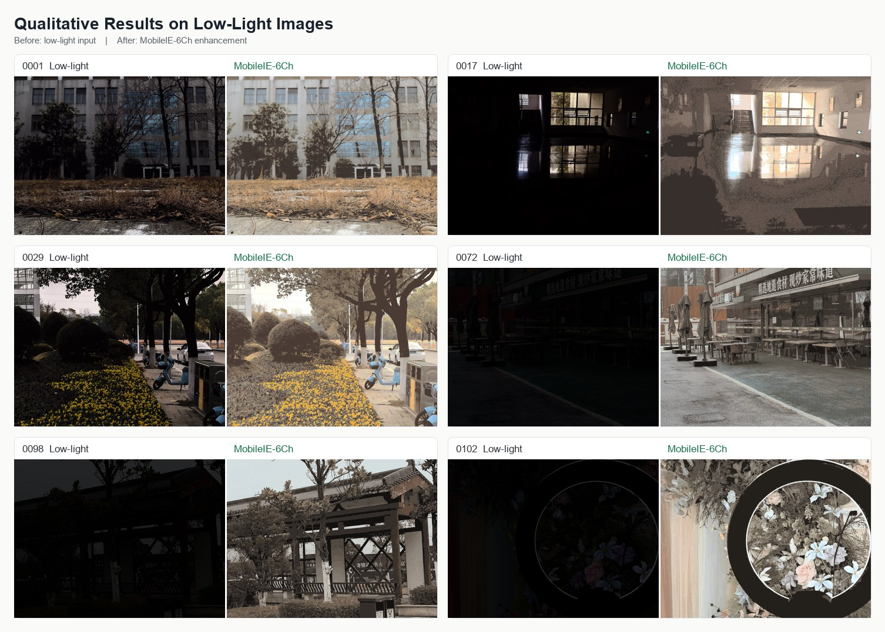
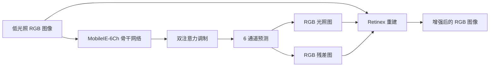

<div align="center">

# MobileIE-6Ch

### 面向 NTIRE 2026 的高效低光照图像增强

**HIT-LLIE-team 在 NTIRE 2026 Efficient Low-Light Image Enhancement Challenge 中的解决方案**

<p>
  <a href="https://arxiv.org/html/2605.02212v1">
    
  </a>
  
  
  
  <a href="./LICENSE">
    
  </a>
</p>

<p>
  <a href="./README.md"><b>English</b></a>
  |
  <a href="https://arxiv.org/html/2605.02212v1"><b>挑战报告</b></a>
  |
  <a href="#快速开始"><b>快速开始</b></a>
  |
  <a href="#结果"><b>结果</b></a>
  |
  <a href="#可复现性"><b>可复现性</b></a>
  |
  <a href="#作者与团队"><b>作者</b></a>
  |
  <a href="#引用"><b>引用</b></a>
</p>

</div>

---

## 概览

**MobileIE-6Ch** 是一个面向高效部署的超轻量低光照图像增强网络。该模型基于 MobileIE 系列，并引入了 **6 通道 Retinex 风格预测头**，用于同时估计：

- **3 个 RGB 光照通道**：用于颜色感知的亮度恢复
- **3 个残差通道**：用于噪声与细节补偿

发布的 checkpoint 仅包含 **101,922 个参数**，同时在严格的 NTIRE 效率约束下仍以获得自然、舒适的视觉增强效果为目标。本仓库包含推理代码、DDP 训练代码、配置文件以及提交使用的 checkpoint。

**推荐的 GitHub 仓库简介**

```text
MobileIE-6Ch 官方 PyTorch 实现：HIT-LLIE-team 面向 NTIRE 2026 Efficient Low-Light Image Enhancement 的解决方案。101.9K 参数 Retinex 风格模型，包含预训练 checkpoint。
```

## 视觉效果

下方示例展示了低光照输入图像及对应的 MobileIE-6Ch 增强结果。模型能够提升场景亮度，并在室内、室外、街景和物体细节场景中恢复可见结构。

<p align="center">
  
</p>

## 为什么选择 MobileIE-6Ch？

| 设计目标 | 实现方式 |
| --- | --- |
| 紧凑推理 | 使用轻量的重参数化 MobileIE 形式，便于部署 |
| 颜色感知光照 | 预测 RGB 光照图，而不是单一灰度光照图 |
| 噪声与细节恢复 | 在 Retinex 除法后加入 RGB 残差分支 |
| 训练容量 | 训练阶段使用 Multi-Branch Reparameterization 提升表达能力 |
| 稳定优化 | 结合 warm-up、EMA、梯度裁剪、余弦调度和多尺度裁剪 |

## 结果

MobileIE-6Ch 已列入官方 **NTIRE 2026 Efficient Low-Light Image Enhancement Challenge** 报告。

| 评测表格 | SSIM | LPIPS | DISTS | LIQE | MUSIQ | Q-Align | 参数量 | 最终排名 |
| --- | ---: | ---: | ---: | ---: | ---: | ---: | ---: | ---: |
| 技术报告主表 | 0.5766 | 0.5176 | 0.2319 | 2.2977 | 60.3387 | 3.2007 | 101,922 | **7** |
| 完整 final-testing 表 | 0.5766 | 0.5176 | 0.2319 | 2.2977 | 60.3387 | 3.2007 | 101,922 | **9** |

完整 final-testing 表包含参与最终测试但未提交技术报告的队伍；主表则统计了挑战报告技术方法章节中包含的队伍。

## 方法

MobileIE-6Ch 采用紧凑的 Retinex 启发式增强流程。模型不再只估计单通道光照，而是联合预测 RGB 光照图和残差修正。



最终图像按如下方式重建：

```text
enhanced = input / illumination + residual
```

训练期间，多分支卷积块用于增强表示能力；推理期间，模型使用轻量的重参数化形式，使 checkpoint 保持小巧并便于部署。

## 快速开始

### 1. 安装环境

```bash
conda create -n mobileie python=3.10 -y
conda activate mobileie
pip install -r requirements.txt
```

如果你的 CUDA 版本需要特定的 PyTorch wheel，请先安装匹配的 PyTorch 构建版本，再安装其余依赖。

### 2. 准备图像

将低光照图像放入：

```text
competition/low/
```

### 3. 运行推理

```bash
python infer_6channel.py
```

增强后的图像将保存到：

```text
competition/enhanced_pt/
```

默认情况下，脚本会加载已发布的 checkpoint：

```text
result/model_best.pt
```

脚本会在 CUDA 可用时自动使用 GPU，否则回退到 CPU。

## 训练

请准备文件名一一对应的成对训练数据：

```text
lowlight/
|-- low/       # 低光照输入
`-- normal/    # 正常光照真值
```

启动 DDP 训练：

```bash
bash train_ddp.sh
```

如需指定 GPU 列表，可使用：

```bash
bash train_ddp.sh "0" 1
bash train_ddp.sh "0,1" 2
bash train_ddp.sh "0,1,2,3" 4
```

主要配置位于 `config/lle.yaml`。

| 配置项 | 值 |
| --- | --- |
| 模型 | MobileIE-6Ch |
| 通道数 | 32 |
| Epochs | 800 |
| Batch size | 16 |
| Warm-up | 20 epochs |
| Learning rate | 1.5e-4 |
| Scheduler | Cosine annealing |
| Patch size | 768 |
| Cross validation | 5 folds |
| EMA | Enabled |
| Gradient clipping | 0.5 |

训练日志和 checkpoint 会写入 `experiments/` 目录。

## 可复现性

本仓库包含复现和检查提交方案所需的核心材料。

| 资源 | 状态 | 说明 |
| --- | --- | --- |
| 源代码 | 已包含 | 模型、数据加载器、loss、指标、推理和 DDP 训练 |
| 预训练 checkpoint | 已包含 | `result/model_best.pt`，101,922 个参数 |
| 训练配置 | 已包含 | `config/lle.yaml` |
| 数据集 | 未重新分发 | 请遵循 NTIRE challenge 的数据集政策 |
| 生成预测结果 | 未纳入跟踪 | 将输入放入 `competition/low/`，输出会保存到 `competition/enhanced_pt/` |
| 引用元数据 | 已包含 | `CITATION.cff` |
| Model card | 已包含 | `docs/MODEL_CARD.md` |
| 复现说明 | 已包含 | `docs/REPRODUCIBILITY.md` |

更多细节请参见 [复现说明](docs/REPRODUCIBILITY.md) 和 [Model Card](docs/MODEL_CARD.md)。

## 仓库结构

```text
.
|-- .github/
|   `-- ISSUE_TEMPLATE/      # Bug report and question templates
|-- docs/
|   |-- MODEL_CARD.md        # Model usage, limitations, and intended scope
|   `-- REPRODUCIBILITY.md   # Reproduction checklist and environment notes
|-- competition/
|   |-- low/                 # Inference inputs
|   `-- enhanced_pt/         # Inference outputs
|-- config/
|   `-- lle.yaml             # Training and model configuration
|-- data/
|   |-- lledata.py           # Low-light enhancement dataset loader
|   `-- ispdata.py
|-- lowlight/
|   |-- low/                 # Training low-light images
|   `-- normal/              # Training ground-truth images
|-- model/
|   |-- lle.py               # Original MobileIE LLE model
|   |-- lle_6channel.py      # MobileIE-6Ch model
|   `-- utils_IWO.py         # MBR and feature modulation blocks
|-- result/
|   `-- model_best.pt        # Released MobileIE-6Ch checkpoint
|-- infer_6channel.py        # Inference entry point
|-- main_ddp.py              # DDP training entry point
|-- train_ddp.sh             # Training launcher
|-- CITATION.cff             # Machine-readable citation metadata
|-- requirements.txt
`-- team_info.txt
```

## 作者与团队

**HIT-LLIE-team**

| 作者 | GitHub | 单位 |
| --- | --- | --- |
| Xinbai Wang | [w-xb](https://github.com/w-xb) | Harbin Institute of Technology |
| Duo Liu | [Cat-blizzard](https://github.com/Cat-blizzard) | Harbin Institute of Technology |

联系方式可在 `team_info.txt` 中查看。

## 引用

如果本仓库对你的研究有帮助，请引用 NTIRE 2026 challenge report 和本方案。

```bibtex
@article{yan2026ntire,
  title={NTIRE 2026 Challenge on Efficient Low Light Image Enhancement: Methods and Results},
  author={Yan, Jiebin and Tu, Chenyu and Lin, Qinghua and others},
  journal={arXiv preprint arXiv:2605.02212},
  year={2026}
}
```

```bibtex
@misc{hitllie2026mobileie6ch,
  title={MobileIE-6Ch: Efficient Low-Light Image Enhancement for NTIRE 2026},
  author={Wang, Xinbai and Liu, Duo},
  year={2026},
  note={HIT-LLIE-team submission to the NTIRE 2026 Efficient Low-Light Image Enhancement Challenge}
}
```

## 致谢

本项目为 **NTIRE 2026 Efficient Low-Light Image Enhancement Challenge** 开发。感谢挑战赛组织者，以及 MobileIE 作者提供的 baseline 启发。

## 许可证

本仓库基于 **Apache License 2.0** 发布。详见 [LICENSE](./LICENSE)。
